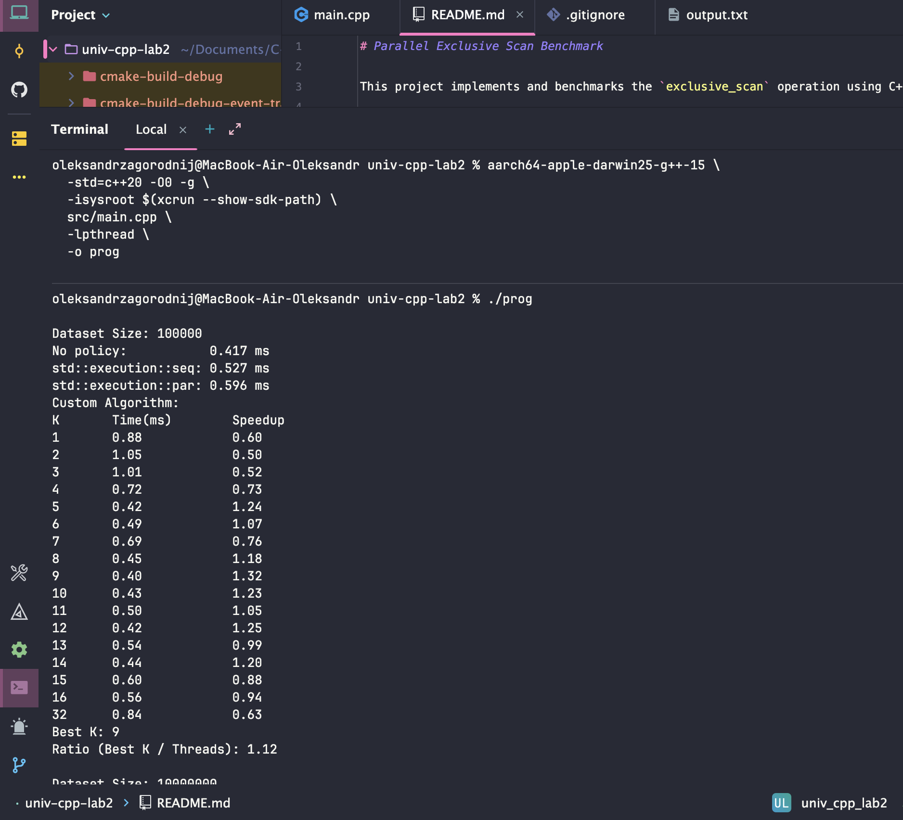
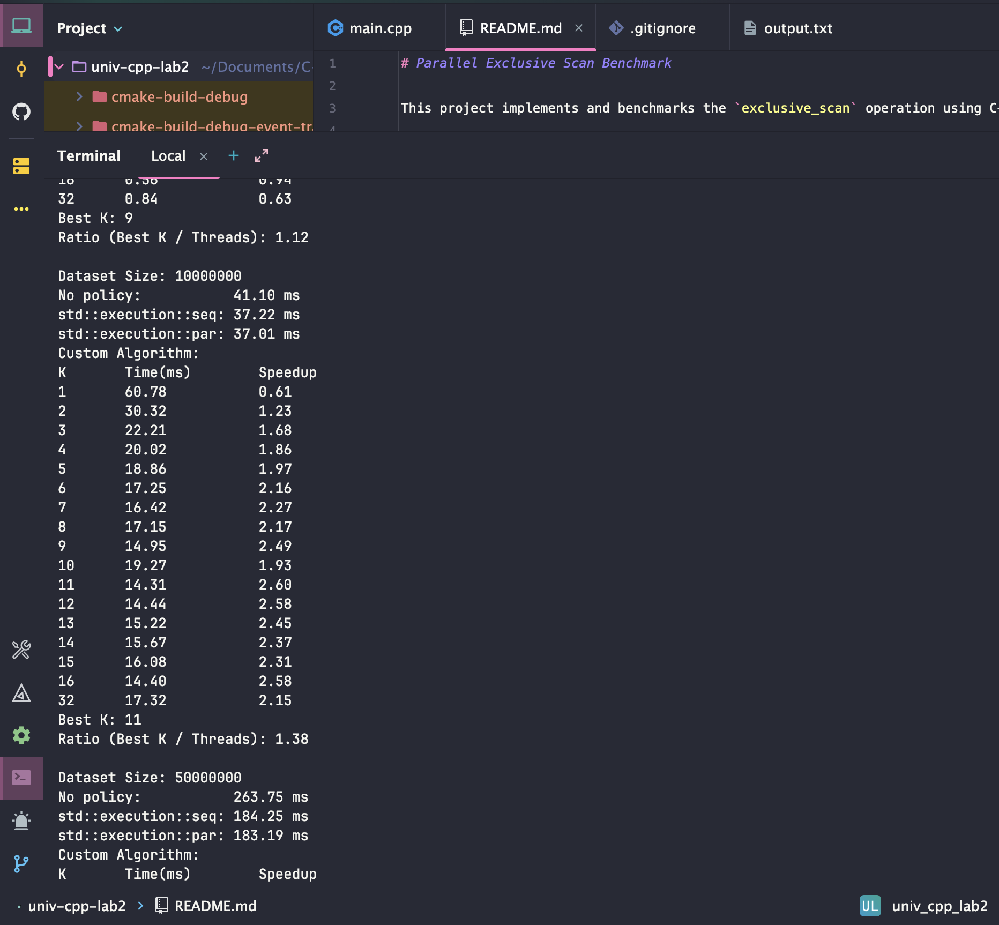
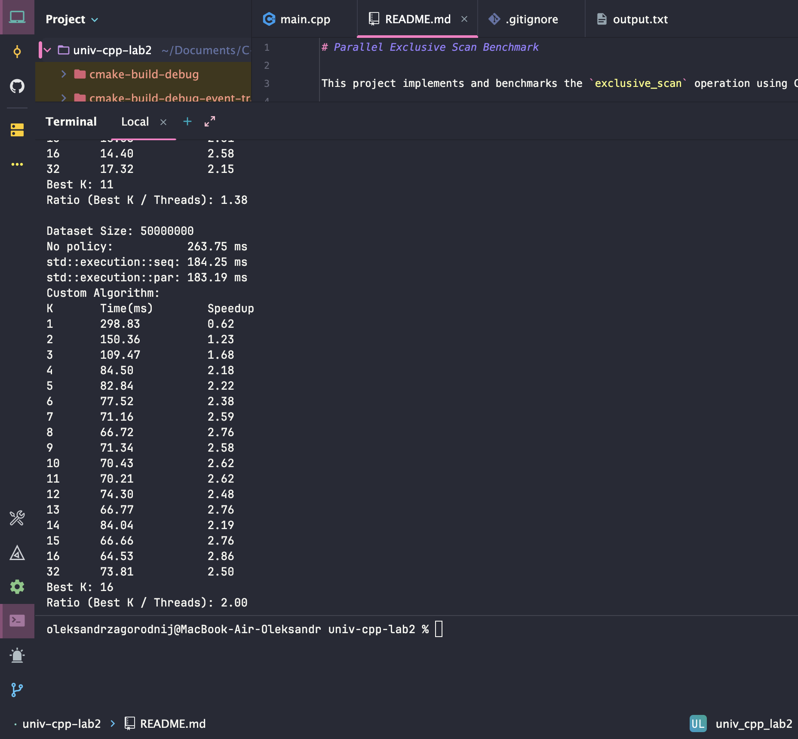

# Parallel Exclusive Scan Benchmark

This project implements and benchmarks the `exclusive_scan` operation using C++20. It compares the Standard Library's sequential and parallel policies against a custom multi-threaded Map-Reduce implementation.

## Release Build & Run

**For maxOS with Apple Silicon:**

```bash
aarch64-apple-darwin25-g++-15 \
  -std=c++20 -O3 -march=native \
  -isysroot $(xcrun --show-sdk-path) \
  src/main.cpp \
  -lpthread \
  -o prog
  
./prog
```
**For other u can build like this:**

```bash
gcc -std=c++20 -O3 -march=native src/main.cpp -lpthread -o prog
./prog
```

## Debug Build & Run

**For maсOS with Apple Silicon:**

```bash
aarch64-apple-darwin25-g++-15 \
  -std=c++20 -O0 -g \
  -isysroot $(xcrun --show-sdk-path) \
  src/main.cpp \
  -lpthread \
  -o prog
  
./prog
```

**For other u can build like this:**

```bash
g++ -std=c++20 -O0 -g src/main.cpp -lpthread -o prog
./prog
```

--- 

# Benchmark Analysis & Configuration

---

# **RELEASE RESULTS**

The following results were obtained on a **MacBook M1** (8 Cores).

### **Release Performance Summary**
| Dataset Size | `std::execution::seq` | `std::execution::par` | Custom Algo (Best K) | Speedup (vs Seq) |
| :--- | :--- | :--- | :--- | :--- |
| **100,000** | 0.037 ms | **0.039 ms** | 0.13 ms (K=2) | ~1.0x |
| **10,000,000** | 4.19 ms | **3.95 ms** | 4.35 ms (K=2) | ~1.0x |
| **50,000,000** | 20.14 ms | **23.20 ms** | 26.85 ms (K=32) | ~0.75x |

---

| K | Time 100k | Speedup 100k | Time 10M | Speedup 10M | Time 50M | Speedup 50M |
|---|-----------|--------------|----------|--------------|-----------|-------------|
| 1 | 0.25 | 0.15 | 6.69 | 0.63 | 48.27 | 0.42 |
| 2 | **0.13** | **0.29** | **4.35** | **0.96** | 30.28 | 0.67 |
| 3 | 0.28 | 0.13 | 5.93 | 0.71 | 28.06 | 0.72 |
| 4 | 0.25 | 0.15 | 5.52 | 0.76 | 26.92 | 0.75 |
| 5 | 0.29 | 0.13 | 6.24 | 0.67 | 27.82 | 0.72 |
| 6 | 0.37 | 0.10 | 6.85 | 0.61 | 29.48 | 0.68 |
| 7 | 0.51 | 0.07 | 6.82 | 0.61 | 28.36 | 0.71 |
| 8 | 0.45 | 0.08 | 5.89 | 0.71 | 29.14 | 0.69 |
| 9 | 0.60 | 0.06 | 6.24 | 0.67 | 33.22 | 0.61 |
| 10 | 0.51 | 0.07 | 6.80 | 0.62 | 29.41 | 0.68 |
| 11 | 0.49 | 0.08 | 6.21 | 0.67 | 29.12 | 0.69 |
| 12 | 0.30 | 0.12 | 6.42 | 0.65 | 28.91 | 0.70 |
| 13 | 0.36 | 0.10 | 6.92 | 0.61 | 29.24 | 0.69 |
| 14 | 0.32 | 0.12 | 5.62 | 0.74 | 54.93 | 0.37 |
| 15 | 0.40 | 0.09 | 7.30 | 0.57 | 31.16 | 0.65 |
| 16 | 0.59 | 0.06 | 6.75 | 0.62 | 27.74 | 0.73 |
| 32 | 0.95 | 0.04 | 6.78 | 0.62 | **26.85** | **0.75** |

**Best K:**  
100k → 2  
10M → 2  
50M → 32

---

# **DEBUG RESULTS**

Below are the results from **Debug mode**, where optimizations are disabled.

---

## **Debug Performance Summary**
| Dataset Size | `No policy` | `seq` | `par` | Custom Best K | Speedup (vs seq) |
| :--- | :--- | :--- | :--- | :--- | :--- |
| **100,000** | 0.417 ms | 0.527 ms | 0.596 ms | **0.40 ms (K=9)** | ~1.32x |
| **10,000,000** | 41.10 ms | 37.22 ms | 37.01 ms | **14.31 ms (K=11)** | ~2.60x |
| **50,000,000** | 263.75 ms | 184.25 ms | 183.19 ms | **64.53 ms (K=16)** | ~2.86x |

---

| K | Time 100k | Speedup 100k | Time 10M | Speedup 10M | Time 50M | Speedup 50M |
|---|-----------|--------------|----------|--------------|-----------|-------------|
| 1 | 0.88 | 0.60 | 60.78 | 0.61 | 298.83 | 0.62 |
| 2 | 1.05 | 0.50 | 30.32 | 1.23 | 150.36 | 1.23 |
| 3 | 1.01 | 0.52 | 22.21 | 1.68 | 109.47 | 1.68 |
| 4 | 0.72 | 0.73 | 20.02 | 1.86 | 84.50 | 2.18 |
| 5 | 0.42 | 1.24 | 18.86 | 1.97 | 82.84 | 2.22 |
| 6 | 0.49 | 1.07 | 17.25 | 2.16 | 77.52 | 2.38 |
| 7 | 0.69 | 0.76 | 16.42 | 2.27 | 71.16 | 2.59 |
| 8 | 0.45 | 1.18 | 17.15 | 2.17 | 66.72 | 2.76 |
| 9 | **0.40** | **1.32** | 14.95 | 2.49 | 71.34 | 2.58 |
| 10 | 0.43 | 1.23 | 19.27 | 1.93 | 70.43 | 2.62 |
| 11 | 0.50 | 1.05 | **14.31** | **2.60** | 70.21 | 2.62 |
| 12 | 0.42 | 1.25 | 14.44 | 2.58 | 74.30 | 2.48 |
| 13 | 0.54 | 0.99 | 15.22 | 2.45 | 66.77 | 2.76 |
| 14 | 0.44 | 1.20 | 15.67 | 2.37 | 84.04 | 2.19 |
| 15 | 0.60 | 0.88 | 16.08 | 2.31 | 66.66 | 2.76 |
| 16 | 0.56 | 0.94 | 14.40 | 2.58 | **64.53** | **2.86** |
| 32 | 0.84 | 0.63 | 17.32 | 2.15 | 73.81 | 2.50 |

**Best K:**  
100k → 9  
10M → 11  
50M → 16


---

# Release vs Debug

**Debug mode is much slower because compiler optimizations are disabled, but the relative scaling between algorithms remains consistent.**

---

### Example Output release


---


---


---

### Example Output debug

---



---



---



---