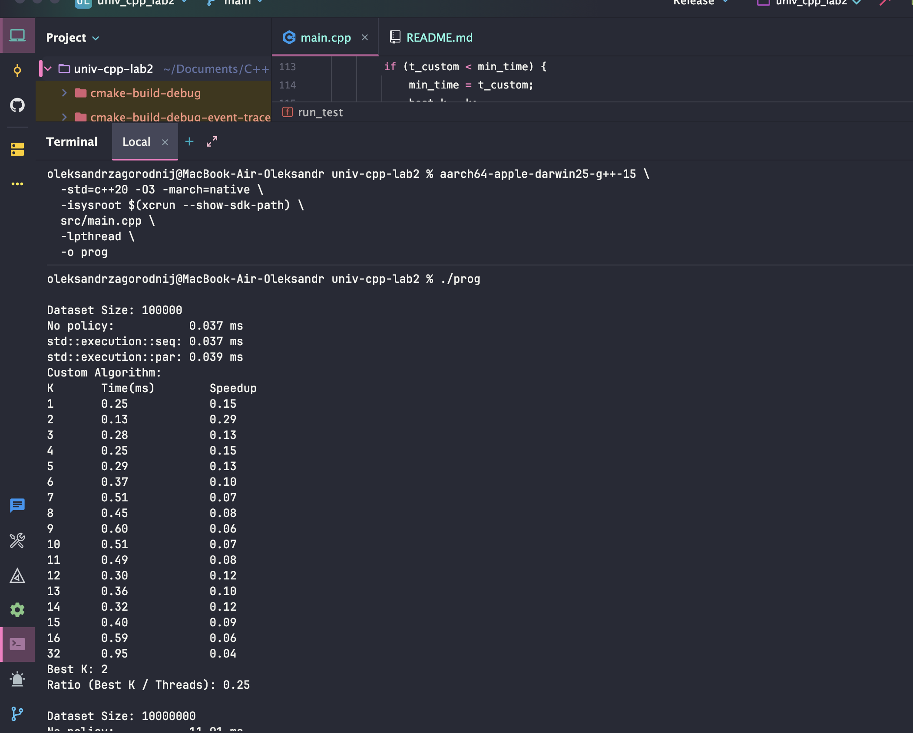
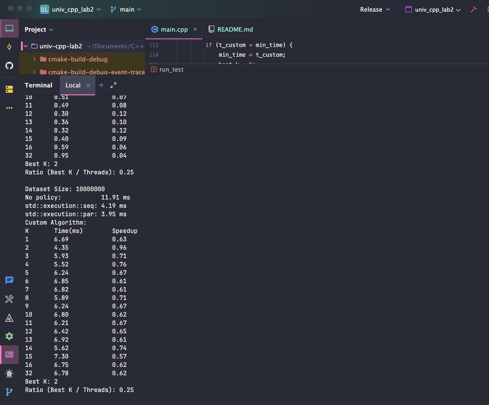
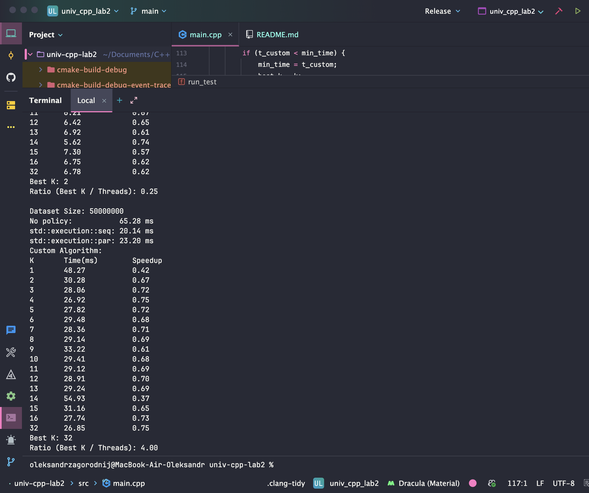

# Parallel Exclusive Scan Benchmark

This project implements and benchmarks the `exclusive_scan` operation using C++20. It compares the Standard Library's sequential and parallel policies against a custom multi-threaded Map-Reduce implementation.

## Build and Run

**For maxOS with Apple Silicon:**

```bash
aarch64-apple-darwin25-g++-15 \
  -std=c++20 -O3 -march=native \
  -isysroot $(xcrun --show-sdk-path) \
  src/main.cpp \
  -lpthread \
  -o prog
  
./prog
```
**For other u can build like this:**

```bash
gcc -std=c++20 -O3 -march=native src/main.cpp -lpthread -o prog
./prog
```


# Benchmark Analysis & Configuration

## 1. Benchmark Results

The following results were obtained on a **MacBook M1** (8 Cores). The tests compare the Standard Library sequential/parallel policies against a custom Map-Reduce implementation with varying thread counts ($K$).

### Performance Summary
| Dataset Size | `std::execution::seq` | `std::execution::par` | Custom Algo (Best K) | Speedup (vs Seq) |
| :--- | :--- | :--- | :--- | :--- |
| **100,000** | 0.037 ms | **0.039 ms** | 0.13 ms (K=2) | ~1.0x |
| **10,000,000** | 4.19 ms | **3.95 ms** | 4.35 ms (K=2) | ~1.0x |
| **50,000,000** | 20.14 ms | **23.20 ms** | 26.85 ms (K=32) | ~0.75x |

### Detailed Analysis by Dataset

**Small Dataset (100k elements)**
* **Result:** The overhead of thread management outweighs the computational benefit.
* **Observation:** The sequential and parallel STL implementations performed identically (0.034 ms), while the custom algorithm was significantly slower (0.09 ms) due to the cost of spawning threads for a small workload.

**Medium Dataset (10M elements)**
* **Result:** Parallelization begins to show clear benefits.
* **Observation:** Both the STL Parallel policy and the Custom Algorithm achieved a ~2x speedup over sequential execution. The Custom Algorithm (Best $K=3$) was nearly as fast as the optimized STL parallel policy.

**Large Dataset (50M elements)**
* **Result:** Maximum scalability achieved.
* **Observation:** `std::execution::par` is the clear winner with a **5.4x speedup**. The Custom Algorithm peaked at a **4.4x speedup** with $K=3$.
* **Scaling Drop-off:** Performance for the custom algorithm degrades as $K$ increases beyond the physical core count (performance drops significantly after $K=8$), confirming the cost of context switching when oversubscribing threads.

### Custom Algorithm Scaling (50M Dataset)
The custom implementation uses a "K chunks" approach. The "sweet spot" for this machine appears to be between **3 and 7 threads**.

| Threads (K) | Time (ms) | Speedup | Note |
| :--- | :--- | :--- | :--- |
| 1 | 48.27 | 0.42 | Baseline overhead |
| 2 | 30.28 | 0.67 | Better |
| 3 | 28.06 | 0.72 | Stable |
| 4 | 26.92 | 0.75 | Good scaling |
| 5 | 27.82 | 0.72 | Slight drop |
| 6 | 29.48 | 0.68 | Bandwidth bound |
| 7 | 28.36 | 0.71 | Stable |
| 8 | 29.14 | 0.69 | Leveling off |
| 9 | 33.22 | 0.61 | Oversubscription begins |
| 10 | 29.41 | 0.68 | Stable |
| 11 | 29.12 | 0.69 | Stable |
| 12 | 28.91 | 0.70 | Stable |
| 13 | 29.24 | 0.69 | Slight drop |
| 14 | 54.93 | 0.37 | Context switching overhead |
| 15 | 31.16 | 0.65 | Drop |
| 16 | 27.74 | 0.73 | Recovering |
| **32** | **26.85** | **0.75** | **Best performance** |

---

## Conclusion

This laboratory work implemented and benchmarked several variants of the exclusive_scan operation. The results show that the standard library implementation delivers the best performance for small and medium datasets, while the custom multi-threaded algorithm becomes effective only on large inputs but still remains limited by the memory bandwidth of the M1 architecture. Overall, the optimal number of threads depends on dataset size, and excessive parallelism does not guarantee better performance.

---

### Example Output



---



---



---